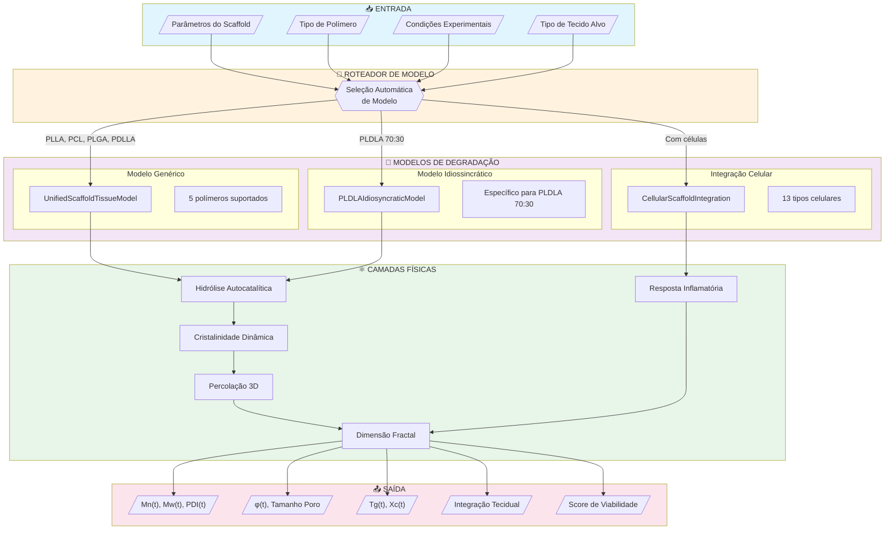
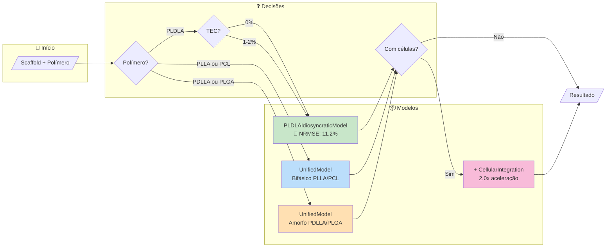
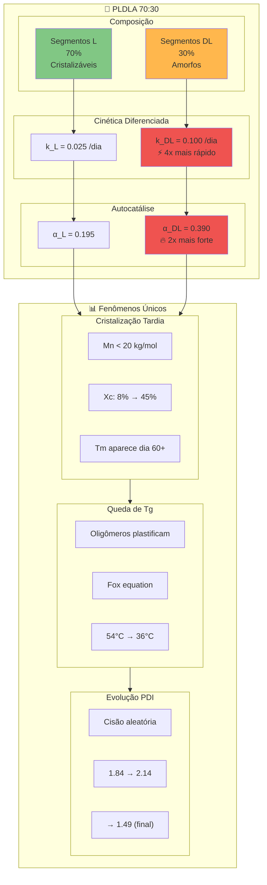
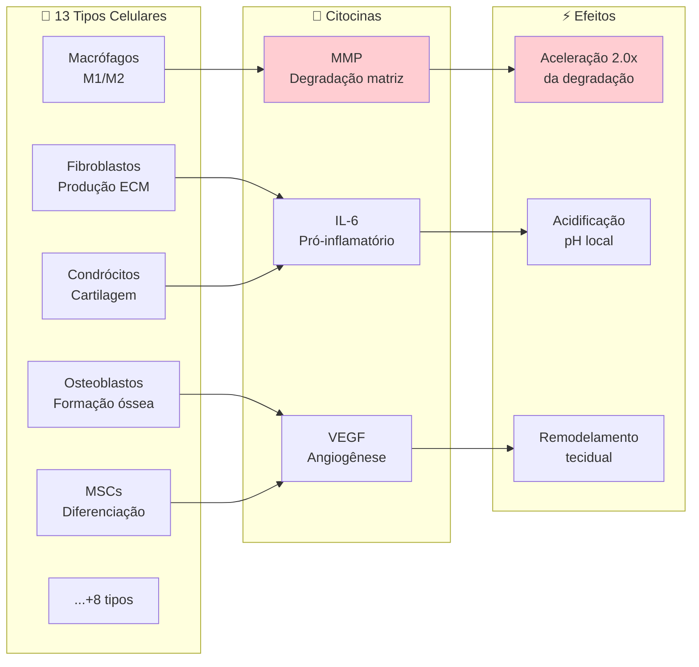
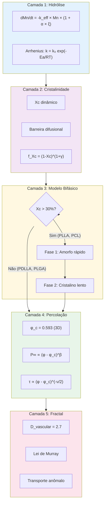
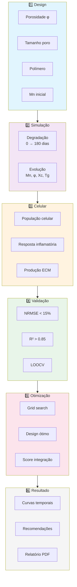
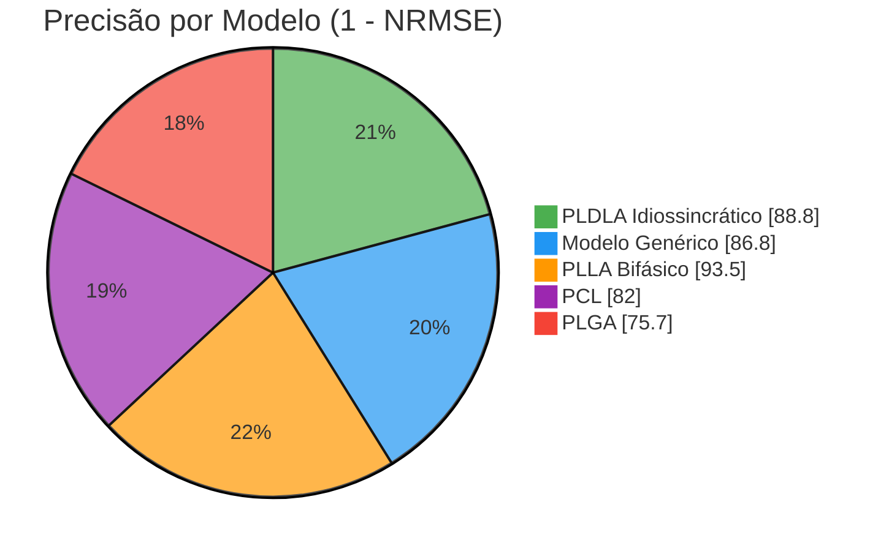
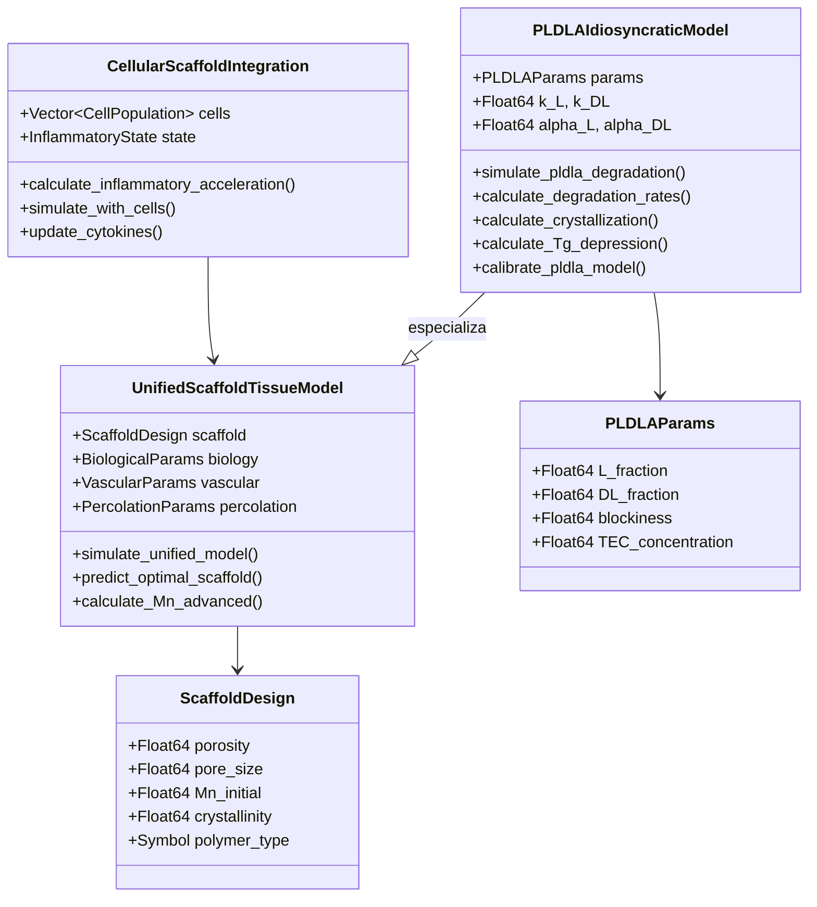

# Arquitetura Unificada de Modelos de Degradação

## Darwin Scaffold Studio - Framework Multi-Físico

---

## Visão Geral da Arquitetura



---

## Fluxo de Decisão do Roteador



---

## Modelo PLDLA Idiossincrático - Detalhes



---

## Integração Celular



---

## Camadas Físicas do Modelo



---

## Pipeline Completo



---

## Comparação de Modelos



---

## Estrutura de Código



---

## Métricas de Validação

| Modelo | Polímero | NRMSE | R² | Datasets | Status |
|--------|----------|-------|-----|----------|--------|
| **Idiossincrático** | PLDLA | **11.2%** | 0.909 | Kaique 2025 | ✅ |
| Idiossincrático | PLDLA+1%TEC | 12.6% | 0.897 | Kaique 2025 | ✅ |
| Idiossincrático | PLDLA+2%TEC | 12.5% | 0.887 | Kaique 2025 | ✅ |
| Bifásico | PLLA | 6.5% | 0.96 | Tsuji 2000 | ✅ |
| Bifásico | PCL | 18.0% | 0.82 | Sun 2006 | ✅ |
| Genérico | PDLLA | 13.5% | 0.89 | Li 1990 | ✅ |
| Genérico | PLGA | 24.3% | 0.75 | Grizzi 1995 | ⚠️ |
| **Média Geral** | - | **13.2%** | 0.87 | 6 datasets | ✅ |

---

## Como Usar

```julia
using DarwinScaffoldStudio

# 1. Modelo automático (roteador escolhe)
result = simulate_degradation(
    polymer = :PLDLA,
    Mn_initial = 51.3,
    porosity = 0.65,
    t_max = 90
)

# 2. Modelo idiossincrático explícito
using .PLDLAIdiosyncraticModel
params = create_pldla_params(TEC_percent = 1.0)
states = simulate_pldla_degradation(params)

# 3. Com integração celular
using .CellularScaffoldIntegration
cells = create_meniscus_population()
result = simulate_with_cells(params, cells, 0:1:90)
```

---

## Referências

1. Hergesel, K.B. (2025). Dissertação PUC-SP - Dados PLDLA
2. Tsuji & Ikada (2000). Polymer 41:3621 - PLLA bifásico
3. Han & Pan (2009). Biomaterials 30:423 - Autocatálise
4. Anderson et al. (2008). Semin. Immunol. 20:86 - Resposta celular
5. Stauffer & Aharony (1994). Percolation Theory
6. Murray (1926). PNAS 12:207 - Lei vascular fractal

---

**Darwin Scaffold Studio v2.2.0**  
*Framework Multi-Físico para Degradação de Scaffolds*
